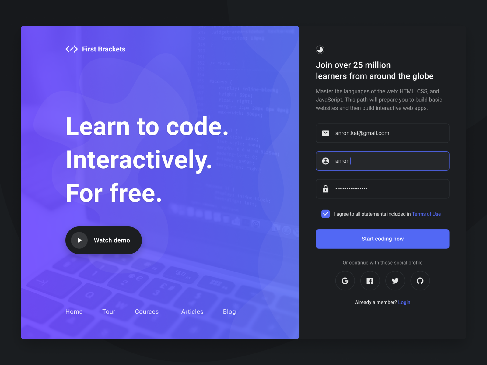

# VUE INTRO 2

## Introduction

> ***Note:*** _This can be a pair programming activity or done independently._

## Learning Goals

After this learning unit, you will be able to:

- Create a basic VueJS app.
- Use different types of forms and validate them
- Use dynamic styles in your Vue Application
- Create components and pass them props
- Filter lists by different criteria

## Requirements

- [Fork this repo](https://guides.github.com/activities/forking/)
- Clone this repo into your `~/code/labs`

## Deliverables

Please, push every file needed to make your app properly on GitHub before creating the pull request.

## Introduction


Today's lab is all about creating a cool signup form, something that will be useful no matter what application you do in your life!

Here is the [Vue Guide](https://vuejs.org/v2/guide/) in case you need it

### Start

To start, create a `index.html` and `signup.js` file. Integrate the `signup.js` and vue code on your html.

```html
<script src="https://cdn.jsdelivr.net/npm/vue/dist/vue.js"></script>
```
Make sure you also add [Bootstrap css](https://getbootstrap.com/) to your index.html so that you can use it in this project!

As an idea, you could you use [this login template](https://getbootstrap.com/docs/4.3/examples/sign-in/) to get started.

### Basic Info

You should start by request the user for their `email` and `password`, and have a **Signup** button.

Make sure they can only signup if their email is correct and the password is longer than 5 characters.

Also, you should add some basic styling if validations are not passing, but none when it's empty.

When the user clicks on the button, if everything is ok, it should display an alert saying `You are IN!`.

### Password Security

Add a new `<input>` in your form to check your password twice. It's a common practice to ensure that you don't miss-type it. This form element will also show a red color if it's not the same as the original, but none when it's empty.

### Country

You need to add a select so that the user will select their country. To do that, you should load the `countries.js` file in your javascript.

*This question is mandatory*

### Gender

We need to ask the user if they are:
* Male
* Female
* Undisclosed

This should be done with radio buttons

### Birthdate

We should ask our users for their birthday. Remember we don't accept any user less than 18 years old.

### Terms and Conditions check

At the bottom of the signup, you should have two checkboxes that the user sees:

1. Acceptance to the Terms and Conditions (mandatory)
2. Acceptance to join the Mailing List (optional)

### Bonus 1

Can you make a Login page with email / password too? The user should be able to toggle between signup/login at any time, but the email/pwd info should persist across the two views.

### Bonus 2

Can you tell the user how secure is their password?

- WEAK - less than 5 characters
- MEDIUM - between 5-10 characters, include number
- HARD - more than 10 characters, include numbers & symbols

If you are brave, you could try integrating [zxcvbn.js](https://github.com/dropbox/zxcvbn) to provide more accurate message about the password security

## Submission

Upon completion, run the following commands:

```
$ git add .
$ git commit -m "done"
$ git push origin master
```

Then create a Pull Request!!


